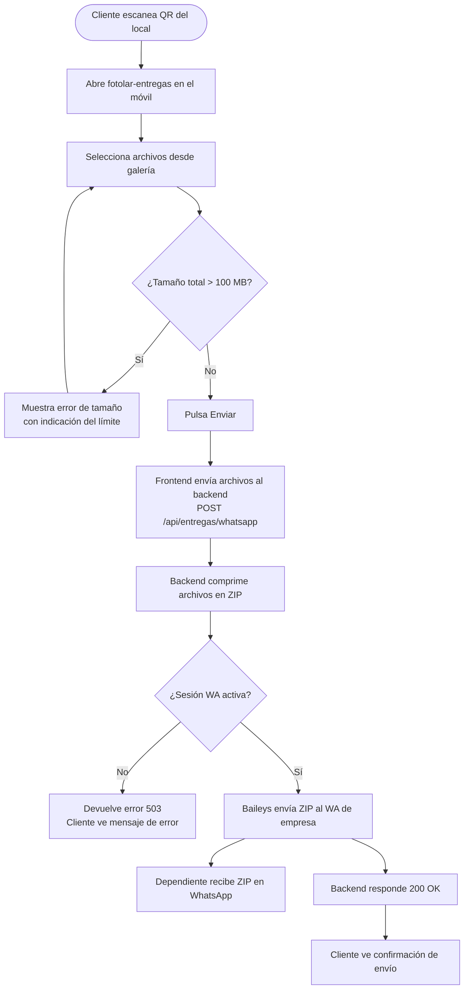
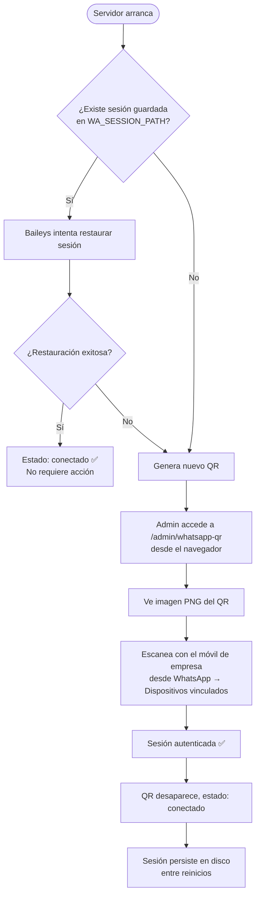
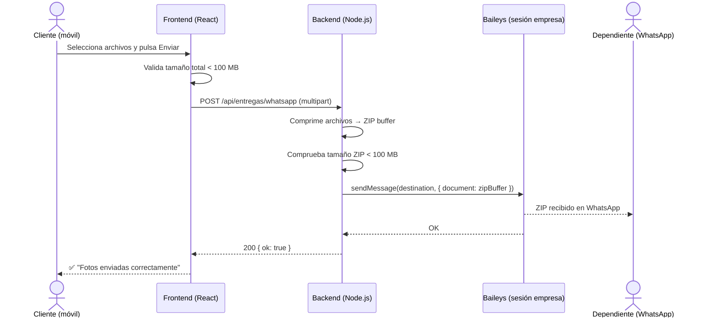

# Análisis Funcional: fotolar-entregas — Integración WhatsApp Business

**Versión:** 1.0
**Fecha:** 26 de junio de 2026
**Autor:** DEVKOMP — Lead Product Owner
**Estado:** Borrador

---

## Índice

1. Contexto y objetivos
2. Definición del MVP
3. Épicas e Historias de Usuario
4. Especificaciones Técnicas
5. Diagramas
6. Casos de Uso
7. Stack Tecnológico Recomendado
8. Criterios de Aceptación Globales
9. Glosario

---

## 1. Contexto y Objetivos

**fotolar-entregas** es una web app orientada a un local de fotografía físico. Los clientes escanean un código QR situado en el local, acceden a la aplicación desde su móvil, seleccionan las fotos que quieren entregar y el sistema las envía de forma automática al equipo interno del local.

Actualmente el sistema tiene implementada la entrega por email. El objetivo de esta iteración es **añadir un canal de entrega alternativo mediante WhatsApp Business**, de forma que las fotos comprimidas en un ZIP lleguen directamente al WhatsApp de empresa, donde los dependientes puedan descargarlas y procesarlas sin fricciones adicionales.

**Objetivos concretos:**

- Mantener una sesión activa de WhatsApp Business en el servidor sin necesidad de interfaz gráfica.
- Proveer un mecanismo seguro de autenticación QR accesible vía navegador (panel de admin).
- Comprimir los archivos seleccionados por el cliente en un ZIP y enviarlo al número/grupo de WhatsApp de empresa de forma automática.
- Controlar el tamaño del ZIP para respetar los límites de WhatsApp (100 MB por archivo).

---

## 2. Definición del MVP

**Problema que resuelve:** El equipo del local recibe fotos de clientes de forma manual o mediante email, lo que genera fricción operativa. Con este MVP, los archivos llegan directamente al WhatsApp de empresa sin intervención manual.

**Usuario objetivo:**
- **Cliente final:** persona en el local que escanea el QR y sube sus fotos desde el móvil.
- **Dependiente:** empleado del local que recibe y gestiona las fotos en el WhatsApp de empresa.
- **Administrador:** persona técnica que gestiona la sesión de WhatsApp en el servidor.

**Funcionalidades IN:**

- Selección de archivos desde la galería del móvil.
- Compresión de los archivos en un ZIP en el backend.
- Envío automático del ZIP al WhatsApp Business de la empresa (número o grupo interno).
- Panel de administración para escanear el QR de WhatsApp y ver el estado de la sesión.
- Control de tamaño máximo del ZIP (límite 100 MB).
- Feedback visual al cliente durante el proceso (cargando, enviado, error).

**Funcionalidades OUT (fuera del MVP):**

- Envío a múltiples destinos simultáneos → se define un único destino (número o grupo) en configuración.
- Historial de entregas persistido en base de datos → queda fuera por simplicidad; los mensajes en WhatsApp son el registro.
- Notificación de confirmación al cliente → el feedback visual en la app es suficiente en este MVP.
- Compresión en múltiples ZIPs si se supera el límite → en MVP se bloquea la subida si supera 100 MB.

**Criterio de éxito:** Un cliente puede seleccionar fotos en la web app y en menos de 30 segundos el dependiente recibe el ZIP en el WhatsApp de empresa, listo para descargar.

---

## 3. Épicas e Historias de Usuario

### Épica 1 — Subida y entrega de archivos por WhatsApp

---

**HU-01 — Seleccionar y enviar archivos por WhatsApp**

```
Como cliente del local,
quiero seleccionar mis fotos desde la galería del móvil y enviarlas por WhatsApp,
para que el equipo del local las reciba sin que yo tenga que hacer nada más.

Criterios de aceptación:
  ✅ El cliente puede seleccionar uno o varios archivos desde su dispositivo.
  ✅ El sistema comprime los archivos en un ZIP antes de enviar.
  ✅ El ZIP llega al WhatsApp Business de la empresa en menos de 30 segundos.
  ✅ El cliente ve un indicador de progreso mientras se procesa el envío.
  ✅ El cliente recibe confirmación visual cuando el envío se ha completado.

Estimación: M
Prioridad: Alta
```

---

**HU-02 — Control de tamaño máximo**

```
Como sistema,
quiero validar que el ZIP generado no supere los 100 MB,
para no exceder el límite de archivos adjuntos de WhatsApp y evitar envíos fallidos.

Criterios de aceptación:
  ✅ Si los archivos seleccionados suman más de 100 MB, se muestra un error antes de procesar.
  ✅ El mensaje de error indica al cliente cuánto espacio está ocupando y el límite disponible.
  ✅ El sistema no genera ni intenta enviar el ZIP si se supera el límite.

Estimación: S
Prioridad: Alta
```

---

**HU-03 — Feedback de error en envío fallido**

```
Como cliente del local,
quiero saber si el envío ha fallado y por qué,
para poder intentarlo de nuevo o avisar a un dependiente.

Criterios de aceptación:
  ✅ Si el envío falla (sesión caída, error de red, archivo demasiado grande), se muestra un mensaje claro.
  ✅ El mensaje diferencia entre error de tamaño, error de sesión y error genérico.
  ✅ Se ofrece la opción de reintentar el envío.

Estimación: S
Prioridad: Media
```

---

### Épica 2 — Gestión de sesión WhatsApp (Panel de Admin)

---

**HU-04 — Escanear QR para autenticar la sesión**

```
Como administrador,
quiero acceder a una URL de administración que muestre el QR de WhatsApp,
para autenticar la cuenta de empresa en el servidor sin necesitar interfaz gráfica.

Criterios de aceptación:
  ✅ La ruta /admin/whatsapp-qr muestra el QR como imagen PNG en el navegador.
  ✅ La ruta está protegida por autenticación básica (usuario y contraseña configurados por variable de entorno).
  ✅ Si la sesión ya está activa, la ruta muestra un mensaje de estado "✅ Sesión activa" en lugar del QR.
  ✅ El QR se refresca automáticamente si el anterior expira antes de ser escaneado.

Estimación: M
Prioridad: Alta
```

---

**HU-05 — Consultar estado de la sesión**

```
Como administrador,
quiero consultar el estado actual de la sesión de WhatsApp desde el panel de admin,
para saber si el sistema puede enviar mensajes sin necesidad de re-autenticar.

Criterios de aceptación:
  ✅ La ruta /admin/whatsapp-status devuelve el estado: conectado, desconectado o reconectando.
  ✅ Se muestra la fecha y hora de la última conexión exitosa.
  ✅ Si la sesión está caída, se muestra un enlace directo al QR para reconectar.

Estimación: S
Prioridad: Media
```

---

**HU-06 — Persistencia de sesión entre reinicios del servidor**

```
Como administrador,
quiero que la sesión de WhatsApp persista aunque el servidor se reinicie,
para no tener que re-escanear el QR en cada despliegue o reinicio.

Criterios de aceptación:
  ✅ Las credenciales de sesión se guardan en disco en una carpeta configurada por variable de entorno.
  ✅ Al arrancar el servidor, se intenta restaurar la sesión automáticamente.
  ✅ Si la restauración falla, se genera un nuevo QR para re-autenticar.

Estimación: S
Prioridad: Alta
```

---

## 4. Especificaciones Técnicas

### 4.1 Endpoint — Subida y envío de archivos

```
POST /api/entregas/whatsapp
Content-Type: multipart/form-data

Body:
  - files: File[]        → archivos a enviar (mínimo 1, máximo ilimitado dentro del límite de 100 MB)
  - nota?: string        → mensaje opcional que acompaña al ZIP (ej. nombre del cliente)

Response 200:
{
  "ok": true,
  "mensaje": "ZIP enviado correctamente al WhatsApp de empresa",
  "tamañoZip": "24.3 MB",
  "timestamp": "2026-06-26T10:45:00Z"
}

Response 400 — Tamaño excedido:
{
  "ok": false,
  "error": "SIZE_EXCEEDED",
  "mensaje": "El total de archivos (112 MB) supera el límite de 100 MB permitido por WhatsApp.",
  "tamañoActual": "112 MB",
  "límite": "100 MB"
}

Response 503 — Sesión no disponible:
{
  "ok": false,
  "error": "WA_SESSION_UNAVAILABLE",
  "mensaje": "La sesión de WhatsApp no está activa. Contacta con el administrador."
}

Response 500 — Error genérico:
{
  "ok": false,
  "error": "SEND_FAILED",
  "mensaje": "Error al enviar el archivo. Inténtalo de nuevo."
}
```

**Lógica de negocio:**

- Precondición: la sesión de WhatsApp debe estar activa (`connection === 'open'`).
- El backend recibe los archivos en memoria (multipart), los comprime con `archiver` o `jszip` en un buffer, y comprueba el tamaño antes de enviar.
- Si el ZIP supera 100 MB, se descarta el buffer y se devuelve error 400 sin intentar el envío.
- El ZIP se nombra con timestamp: `fotolar_YYYYMMDD_HHmmss.zip`.
- Si se incluye `nota`, se envía como mensaje de texto previo al ZIP en el mismo chat.
- Postcondición: el ZIP aparece en el chat/grupo de destino configurado en variables de entorno.

---

### 4.2 Endpoint — Estado de sesión WhatsApp

```
GET /admin/whatsapp-status
Authorization: Basic (usuario:password en Base64)

Response 200:
{
  "estado": "conectado" | "desconectado" | "reconectando",
  "ultimaConexion": "2026-06-26T09:00:00Z" | null,
  "qrDisponible": false
}
```

---

### 4.3 Endpoint — QR de autenticación

```
GET /admin/whatsapp-qr
Authorization: Basic (usuario:password en Base64)

Response 200 (sesión inactiva): HTML con  del QR actual
Response 200 (sesión activa):   HTML con mensaje "✅ Sesión activa desde [fecha]"
Response 401:                   No autorizado
```

---

### 4.4 Variables de entorno requeridas

```env
# WhatsApp
WA_SESSION_PATH=./wa-session          # Ruta donde se persiste la sesión de Baileys
WA_DESTINATION=34600000000@s.whatsapp.net   # Número destino (o ID de grupo)
WA_ZIP_MAX_MB=100                     # Límite de tamaño del ZIP en MB

# Panel de admin
ADMIN_USER=admin
ADMIN_PASS=cambiar_en_produccion

# Servidor
PORT=3000
NODE_ENV=production
```

**Formato del destino:**
- Número individual: `34600000000@s.whatsapp.net` (prefijo de país sin `+`, sufijo `@s.whatsapp.net`)
- Grupo: `XXXXXXXXXXXXXXXXXX@g.us` (el ID del grupo se obtiene mediante Baileys una vez conectado)

---

### 4.5 Módulo WhatsApp — Inicialización de Baileys

```js
// src/services/whatsappService.js

import makeWASocket, { useMultiFileAuthState, DisconnectReason } from '@whiskeysockets/baileys'
import { Boom } from '@hapi/boom'
import qrcode from 'qrcode'

let sock = null
let connectionState = 'desconectado'
let lastConnected = null
let currentQRBase64 = null

export async function initWhatsApp() {
  const { state, saveCreds } = await useMultiFileAuthState(process.env.WA_SESSION_PATH)

  sock = makeWASocket({ auth: state, printQRInTerminal: false })

  sock.ev.on('connection.update', async ({ qr, connection, lastDisconnect }) => {
    if (qr) {
      currentQRBase64 = await qrcode.toDataURL(qr)
      connectionState = 'desconectado'
    }

    if (connection === 'open') {
      connectionState = 'conectado'
      lastConnected = new Date().toISOString()
      currentQRBase64 = null
    }

    if (connection === 'close') {
      const shouldReconnect =
        new Boom(lastDisconnect?.error)?.output?.statusCode !== DisconnectReason.loggedOut
      connectionState = shouldReconnect ? 'reconectando' : 'desconectado'
      if (shouldReconnect) initWhatsApp() // reconexión automática
    }
  })

  sock.ev.on('creds.update', saveCreds)
}

export function getStatus() {
  return { estado: connectionState, ultimaConexion: lastConnected, qrDisponible: !!currentQRBase64 }
}

export function getQRBase64() {
  return currentQRBase64
}

export async function sendZip(zipBuffer, filename, nota) {
  if (connectionState !== 'conectado') throw new Error('WA_SESSION_UNAVAILABLE')
  const destination = process.env.WA_DESTINATION
  if (nota) await sock.sendMessage(destination, { text: nota })
  await sock.sendMessage(destination, {
    document: zipBuffer,
    mimetype: 'application/zip',
    fileName: filename
  })
}
```

---

## 5. Diagramas

### 5.1 Flujo completo del cliente



---

### 5.2 Flujo de autenticación de sesión (Admin)



---

### 5.3 Diagrama de secuencia — Envío de archivos



---

## 6. Casos de Uso

### CU-01 — Envío de fotos por WhatsApp

```
Caso de Uso: Envío de fotos comprimidas al WhatsApp de empresa
Actor principal: Cliente del local
Precondición: 
  - La sesión de WhatsApp Business está activa en el servidor.
  - El cliente tiene acceso a la web app (ha escaneado el QR del local).

Camino feliz (flujo principal):
  1. El cliente selecciona uno o varios archivos desde su galería.
  2. El frontend valida que el total no supera 100 MB.
  3. El cliente pulsa "Enviar".
  4. El frontend muestra un indicador de progreso.
  5. El backend recibe los archivos, genera el ZIP y lo envía via Baileys.
  6. El backend responde con 200 OK.
  7. El frontend muestra confirmación visual al cliente.
  8. El dependiente recibe el ZIP en el WhatsApp de empresa.

Flujos alternativos:
  2a. Los archivos superan 100 MB: el frontend muestra error de tamaño y no procede al envío.
  5a. La sesión de WhatsApp no está activa: el backend devuelve 503 y el frontend muestra
      "Servicio no disponible. Contacta con el personal del local."
  5b. Error en la compresión o envío: el backend devuelve 500 y el frontend ofrece reintentar.

Postcondición: El ZIP está disponible en el chat/grupo de WhatsApp de empresa para ser descargado por el dependiente.
```

---

### CU-02 — Autenticación de sesión WhatsApp

```
Caso de Uso: Escaneo del QR de WhatsApp para autenticar la cuenta de empresa
Actor principal: Administrador
Precondición:
  - El servidor está en ejecución con Baileys inicializado.
  - No existe sesión activa previa (primer arranque o sesión expirada).

Camino feliz (flujo principal):
  1. El administrador accede a /admin/whatsapp-qr desde un navegador.
  2. El sistema solicita credenciales de admin (HTTP Basic Auth).
  3. El administrador introduce usuario y contraseña correctos.
  4. El sistema muestra la imagen PNG del QR actual.
  5. El administrador abre WhatsApp Business en el móvil de empresa.
  6. Accede a Ajustes → Dispositivos vinculados → Vincular dispositivo.
  7. Escanea el QR mostrado en pantalla.
  8. WhatsApp autentica la sesión y Baileys recibe confirmación.
  9. El sistema guarda las credenciales en WA_SESSION_PATH.
  10. La página muestra "✅ Sesión activa".

Flujos alternativos:
  3a. Credenciales incorrectas: el sistema devuelve 401 y solicita de nuevo.
  4a. El QR ha expirado antes de ser escaneado: Baileys genera uno nuevo automáticamente
      y la página se refresca mostrando el nuevo QR.
  8a. El escaneo falla: WhatsApp muestra error en el móvil; el administrador puede reintentar.

Postcondición: La sesión queda persistida en disco y el servidor puede enviar mensajes de WhatsApp sin nueva intervención.
```

---

## 7. Stack Tecnológico Recomendado

| Capa | Tecnología | Justificación |
|---|---|---|
| Frontend | React 19 + Vite + TypeScript | Ya implementado en fotolar-entregas. Selector de archivos nativo con input[type=file] multiple. |
| Backend | Node.js + Express | Ya implementado. Ecosistema npm nativo para Baileys y archiver. Sin necesidad de cambiar runtime. |
| WhatsApp | @whiskeysockets/baileys | Implementación directa del protocolo WA sin Puppeteer. Ligero para VPS Ubuntu sin GUI. |
| Compresión | archiver (npm) | Stream-based, eficiente en memoria. Permite comprimir sin escribir a disco. |
| QR Admin | qrcode (npm) | Genera PNG en base64 desde Node.js para servir en el panel de admin. |
| Autenticación admin | HTTP Basic Auth (middleware Express) | Suficiente para una ruta interna de bajo tráfico. Sin necesidad de JWT ni sesiones. |
| Persistencia sesión WA | Sistema de archivos (useMultiFileAuthState) | Solución nativa de Baileys. Sin base de datos adicional. |
| Infraestructura | VPS IONOS Ubuntu + Nginx + PM2 | Entorno ya disponible. PM2 gestiona el proceso Node y los reinicios automáticos. |

---

### Dependencias npm a añadir

```bash
npm install @whiskeysockets/baileys qrcode archiver @hapi/boom
```

---

### Estructura de archivos sugerida

```
src/
├── services/
│   └── whatsappService.js     # Inicialización Baileys, estado, envío
├── routes/
│   ├── entregas.js            # POST /api/entregas/whatsapp
│   └── admin.js               # GET /admin/whatsapp-qr, /admin/whatsapp-status
├── middleware/
│   └── basicAuth.js           # Protección de rutas de admin
└── app.js                     # Entry point, inicializa WhatsApp al arrancar
```

---

## 8. Criterios de Aceptación Globales

- [ ] El ZIP llega al WhatsApp de empresa en menos de 30 segundos desde que el cliente pulsa "Enviar".
- [ ] El sistema rechaza archivos que superen 100 MB con mensaje claro antes de procesar.
- [ ] La sesión de WhatsApp se restaura automáticamente tras reinicio del servidor si las credenciales están en disco.
- [ ] El panel de admin `/admin/whatsapp-qr` está protegido y no es accesible sin credenciales.
- [ ] El frontend muestra estados diferenciados: cargando, éxito y error (con mensaje específico por tipo de error).
- [ ] El servidor funciona en Ubuntu sin interfaz gráfica (sin dependencia de Puppeteer ni display virtual).
- [ ] Los logs del servicio de WhatsApp son visibles via PM2 (`pm2 logs`) para facilitar el diagnóstico.

---

## 9. Glosario

| Término | Definición |
|---|---|
| **Baileys** | Librería Node.js de código abierto que implementa el protocolo de WhatsApp Web sin Puppeteer. |
| **QR de vinculación** | Código QR que genera WhatsApp para autenticar un nuevo dispositivo vinculado a una cuenta. |
| **wa-session** | Carpeta en disco donde Baileys persiste las credenciales de sesión tras la autenticación. |
| **ZIP** | Archivo comprimido que agrupa todas las fotos seleccionadas por el cliente en un único fichero. |
| **Destino WA** | Número de teléfono o ID de grupo de WhatsApp al que se envían los ZIPs. Configurado por variable de entorno. |
| **HTTP Basic Auth** | Mecanismo de autenticación HTTP estándar que envía usuario y contraseña en la cabecera Authorization. |
| **useMultiFileAuthState** | Función de Baileys que gestiona la lectura y escritura de credenciales de sesión en el sistema de archivos. |
| **PM2** | Process manager para Node.js que gestiona procesos en producción, reinicios automáticos y logs. |
